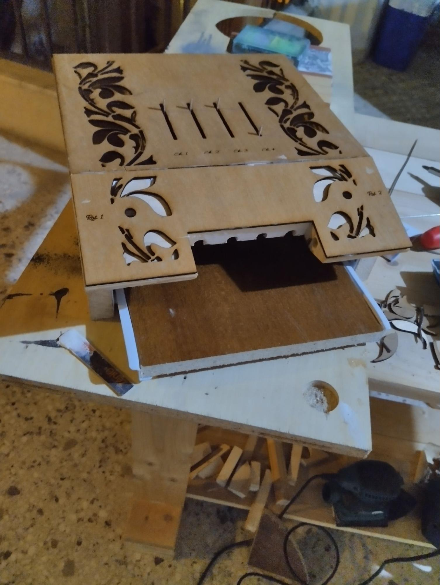
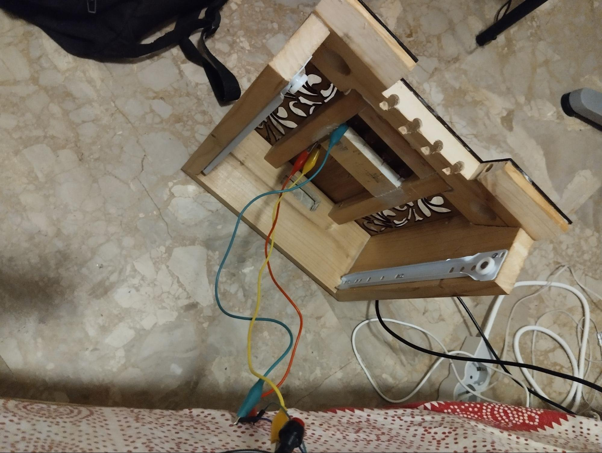

<div align="center">
Ιόνιο Πανεπιστήμιο

Τμήμα Τεχνών Ήχου και Εικόνας

Πρόγραμμα Μεταπτυχιακών Σπουδών “Οπτικοακουστικές Τέχνες στην Ψηφιακή Εποχή”

Μάθημα: Διαδραστικός Ηχητικός Σχεδιασμός

Διδάσκοντες: Ιωάννης Ζάννος

# Το Έπιπλο-Midi

Πειραματισμοί με midi πληροφορία και ξυλουργική.


Ρήγας Κούγκολος - ava.ada2206

Κέρκυρα 2022-2023

</div>

* * *

Εισαγωγή
--------

Το Έπιπλο-Midi είναι ένα midi controller που λειτουργεί με την χρήση ενός Arduino Uno. Η δημιουργία ενός midi controller είναι κάτι που με ενδιέφερε απο καιρό οπότε και αποφάσισα να το κανω στα πλαίσια του μαθήματος. Η ιδέα της, επηρεασμένης από την art nouveau[\[1\]](#ftnt1), αισθητικής προέκυψε από την εργασία του μαθήματος “Τέχνη και Τεχνολογία”[\[2\]](#ftnt2), όπου επιχείρησα να φτιάξω μία κατασκευή βασισμένη στο αρχέτυπο της τηλεόρασης. Ωστόσο οι κατασκευαστικές ανάγκες με οδήγησαν στο αρχέτυπο της παλιάς, μη-επίπεδης τηλεόρασης. Έτσι σαν συνέχεια του έργου εκείνου, αν και με μία σαρκαστική διάθεση στην απαίτηση του εμπορίου η τέχνη να παράγεται από εμμονικά υποκείμενα[\[3\]](#ftnt3) [\[4\]](#ftnt4), αποφάσισα για το μουσικό όργανο, να χρησιμοποιήσω ένα αντίστοιχα παλιό αρχέτυπο, αυτό του ραδιοφώνου-έπιπλου.

<iframe src="https://player.vimeo.com/video/869471267?h=37ff65733a" width="640" height="564" frameborder="0" allow="autoplay; fullscreen" allowfullscreen></iframe>

Θεωρητικό Πλαίσιο
-----------------

Η εργασία ήταν σε μεγάλο βαθμό πρακτική, και δεν προηγήθηκε κάποια θεωρητική ενασχόληση. Ωστόσο πιστεύω πως έχει νόημα να γίνει λόγος για την κουλτούρα του diy που συντηρείται μέσα από τέτοια πρότζεκτ και τον διαμοιρασμό της τεχνογνωσίας που προκύπτει, κάτι που σκοπευώ να κάνω σε μία ομάδα μουσικής τεχνολογίας που συμμετέχω αραιά. Όπως και εγώ δεν θα μπορούσα να έχω κατασκευάσει το εν λόγω όργανο χωρίς τους οδηγούς για το πρωτοκολλο MIDI[\[5\]](#ftnt5), φίλους που μοιράστηκαν τις ξυλουργικές τους γνώσεις[\[6\]](#ftnt6), επεξηγηματικά βίντεο για το SuperCollider[\[7\]](#ftnt7), μέρος της διαδικασίας, είναι για εμένα η ζωή του έργου μετά την υλοποίηση του, μεσω της χρησης του και του διαμοιρασμού των εμπειριών κατασκευής. Δευτερευόντως, η χρήση ανακυκλωμένου ξύλου, πέρα από προσωπικό χόμπι, είναι και προταγματική επιλογή, αλλά και σε πιο προσωπικό επίπεδο, κάτι που δίνει στο έργο μια προσωπική ιστορία του πως η πρόσοψη του είναι από κόντρα πλακέ πάτους συρταριών από ανακαίνιση γραφείου, τα τοιχώματα απο ταβλες διπλου κρεβατιού, το συρτάρι από μελαμίνη βιβλιοθήκης επαγγελματικού χώρου και τα εσωτερικά στηρίγματα από πόδια παιδικού τραπεζιού ζωγραφικής.

Στόχοι και ερωτήματα
--------------------

Γνωρίζοντας πως το πρότζεκτ είναι μεγάλο για εμένα, περιορίστηκα στους εξής στόχους.

*   Το όργανο να λειτουργεί με καλώδιο midi[\[8\]](#ftnt8).

*   Να μπορώ να προγραμματίσω σε ποιό κανάλι στέλνω την πληροφορία.
*   Να παραπέμπει αισθητικά σε έπιπλο, ιδανικά του προηγούμενου αιώνα.

Τεχνική ανάλυση
---------------

Αντιλαμβάνομαι πως η επέκταση μου πάνω στο θέμα της ξυλουργικής ξεφεύγει του ζητούμενου της εργασίας, αλλά θα ήταν άδικο να μην μιλήσω για αυτό, καθώς ήταν πολύ μεγάλο κομμάτι της. Προσωπικά, δεν έχω καποιο background στην ξυλουργική, ούτε συγγενείς ή συγκατοίκους που να ασχολούνται. Αυτό πρακτικά σήμαινε πως μεγάλο μέρος της ενασχόλησης μου γινότανε με παρακάμψεις και χωρίς καθόλου ασφάλεια (παραδείγματος χάρη, να κρατάω με το ένα χέρι το ξύλο, με το αλλο τη σεγα, και με την πατούσα να το στηρίζω). Αυτό που έχει σημασία, είναι πως το συγκεκριμένο πρότζεκτ αποτέλεσε την αφορμή, να κατασκευάσω έναν πάγκο εργασίας, που είναι η πιό δυσκολη κατασκευή που έχω κάνει ως τώρα, με μεγάλη ακρίβεια, 8 συνδέσμους μόρσου - εγκοπής[\[9\]](#ftnt9), κλπ.

<table>
  <tr>
    <td valign="top"></td>
    <td valign="top"></td>
  </tr>
</table>

<table>
  <tr>
    <td valign="top"></td>
    <td valign="top"></td>
    <td valign="top"></td>
  </tr>
</table>

<p align="center"> Εικόνες 1-5. Το έπιπλο που ενεπνευσε το σχέδιο, το τρισδιάστατο μοντέλο που σχεδίασα, εικόνες από την κατασκευή, το τελικό αποτέλεσμα </p>

Στη συνέχεια σχεδίασα και κατασκεύασα το Έπιπλο-Midi πάνω στον πάγκο εργασίας:

<table>
  <tr>
    <td valign="top"></td>
    <td valign="top"></td>
    <td valign="top"></td>
  </tr>
</table>

<p align="center">Εικόνες 6-8. Το τρισδιάστατο μοντέλο, εικόνες από την κατασκευή.</p>

Η πρόσοψη χαράχτηκε με laser[\[10\]](#ftnt10), στο λογισμικό Lightburn.

<table>
  <tr>
    <td valign="top"></td>
    <td valign="top"></td>
    <td valign="top"></td>
  </tr>
</table>

<p align="center"> Εικόνες 9-11. Το σχέδιο[\[11\]](#ftnt11) για το ένα από τα δύο μέρη, η τηλεδιάσκεψη στην οποία παρακολουθούσα το λέιζερ για λόγους ασφαλείας, η εικόνα πάνω στο όργανο. </p>

Στη συνέχεια σύνδεσα τα ποτενσιόμετρα και τα κουμπιά. Τα κουμπιά διακόπτουν την σύνδεση των sliders, σαν mute channel. Τα 4 sliders και τα 2 περιστρεφόμενα ποτενσιόμετρα είναι αθροιστικά 6, το μεγιστο που μπορεί να δεχτεί σαν είσοδο το arduino uno, όσον αφορά αναλογική είσοδο πληροφορίας, χωρίς την χρήση multiplexer. Μπροστά από τα κουμπιά έχω βάλει κομμάτια από ξύλο για να τους δώσω την αίσθηση κουμπιών παλιού κασετοφώνου, αλλά αυτό επιδέχεται βελτίωση ακόμα.

<table>
  <tr>
    <td valign="top"></td>
    <td valign="top"></td>
    <td valign="top"></td>
  </tr>
</table>

<p align="center"> Εικόνες 12-14. Εικόνες από την σύνδεση των καλωδίων </p>

Στη συνέχεια, έγραψα τον κώδικα για το arduino[\[12\]](#ftnt12), βασιζόμενος σε κάποιες δοκιμές που είχα κάνει πρίν κάποιους μήνες όταν πρωτοξεκίνησα να ασχολούμαι με την εργασία. Το ενδιαφέρον εδώ είναι πως ο κώδικας που παρήγαγε τα πιό αξιόπιστα αποτελέσματα ήταν αυτός που δεν χρησιμοποιούσε καμία βιβλιοθήκη για midi πληροφορία, αλλά μπορούσες να δείς με πολύ μεγάλη ακρίβεια τι πληροφορία στέλνει. Χρησιμοποίησα επίσης το πρόγραμμα MidiView για να μπορώ να βλέπω ακριβώς τι διαβάζει η κάρτα ήχου και να κάνω debugging.

Τέλος, έκανα κάποιες δοκιμές στο ableton, αλλά αποφάσισα να δοκιμάσω και το supercollider[\[13\]](#ftnt13) για την παραγωγή ήχου. To τελικό αποτέλεσμα είναι αρκετά πρωτόγονο, αλλά λειτουργεί. Αυτό που έχω προσπαθήσει να κάνω είναι καθένα από τα 6 ποτενσιόμετρα να παράγει ημιτονοειδή ήχο σε διαφορετικά φάσματα συχνοτήτων, και όλα μαζί να περνάνε από έναν μίκτη που δίνει ρυθμό μέσω ενός LFO. Πιο συγκεκριμένα, αυξομειώνει περιοδικά την ένταση καθε ήχου που παράγεται. Όπως φαίνεται και στα παραθέματα όπου παραθέτω όλες μου τις συνομιλίες (τουλάχιστον την τελική τους μορφή) χρησιμοποίησα εκτενώς το chatbot ChatGPT 3.5. Αξίζει να αναφέρω πως γενικά έχει πολλά να προσφέρει, αλλά η κατανόηση του για τον τρόπο λειτουργίας του SuperCollider είναι περιορισμένη. Συχνά προέκυπταν θέματα που δεν μπορούσε να λύσει το ίδιο και οι λύσεις ερχόταν από άλλες πηγές. Ήταν ωστόσο μία πολύ χρήσιμη, άμεσα-προσβάσιμη, αναξιόπιση πηγή.

Συμπεράσματα
------------

Πολλά πράγματα θα μπορούσαν να βελτιωθούν στην κατασκευή, ιδίως όσον αφορά τις θέσεις των καλωδίων και της πλακέτας του arduino, καθώς και θα μπορούσαν να προστεθούν. Το Έπιπλο-Midi, εχει ενα συρτάρι, στο οποίο θα ήθελα κάποια στιγμή να δοκιμάσω να βάλω δύο ξύλινους δίσκους σαν turntables, και να στέλνουν και αυτά πληροφορία MIDI μέσω rotary encoders. Το βασικό θέμα είναι πως δεν γνωρίζω πως λειτουργούν τέτοια όργανα, καθώς δεν έχω χρησιμοποιήσει ποτέ. Θα προσπαθήσω να δανειστώ κάποιο και να διαβάσω την πληροφορία που στέλνει. Χρειάζεται επίσης τρίψιμο και βερνίκι, ενδείξεις στην μηδενική θέση για τα ποτενσιόμετρα, βελτίωση των κουμπιών, και ξύλο για την πάνω μεριά των sliders. Συνολικά είμαι ικανοποιημένος από τον πειραματισμό.

Βιβλιογραφία
------------

Βιβλία:

Tschudi-Madsen, Stephan. The Art Nouveau Style: a comprehensive guide with 264 illustrations. Courier Corporation, 2002.

Άρθρα:

Chatterjee, Anjan. "The neuropsychology of visual art: Conferring capacity." International review of neurobiology 74 (2006): 39-49.

Weber, Ryan. "The Artistic Worker Versus the White-collar Professional: Workaholism, Work/nonwork Interference and Enhancement, and Obsessive Compulsive Behavior in Two Samples." (2011).

Lehrman, Paul D., and Tim Tully. "What is MIDI?." (2017).

Ιστοσελίδες:

3PA Formation. “Éducation, Formation, Insertion.” Accessed September 27, 2023. https://www.3paformation.fr/education-formation-insertion/.

Crypto Museum “DIN.” Πρόσβαση 27 Σεπτεμβρίου, 2023.

Βίντεο:

Eli Fieldsteel. SuperCollider Tutorial: 9. MIDI, Part I. Accessed September 27, 2023. https://www.youtube.com/watch?v=Oz4KYZ9KLc0.

Olivier Verdier. COMMENT FAIRE UN TENON ET UNE MORTAISE AU CISEAU À BOIS. Πρόσβαση 27 Σεπτεμβρίου, 2023. https://www.youtube.com/watch?v=8S4HxV5KAEU.

* * *

Παραθέματα
----------

#### Συζητήσεις με το ChatGPT 3.5

[SuperCollider: Execute Code Blocks](https://www.google.com/url?q=https://chat.openai.com/share/61bc8b35-c9e1-4ad4-a3f0-acdd27f5dd3d&sa=D&source=editors&ust=1695977985486032&usg=AOvVaw1ZDEOFspxsPigMiGtFHTis)

[Create SuperCollider Sound Code](https://www.google.com/url?q=https://chat.openai.com/share/94952f12-2416-47e1-8454-ab754aca87a9&sa=D&source=editors&ust=1695977985486430&usg=AOvVaw1_mRP6CdEWXF4AGI8gc58b)

[Creating Kick Drum Sounds](https://www.google.com/url?q=https://chat.openai.com/share/791da280-3eb4-4223-a0df-c112e20ed984&sa=D&source=editors&ust=1695977985486702&usg=AOvVaw2LjBRFtcu4h5UfKUQPzCKj)

[SuperCollider Syntax Overview](https://www.google.com/url?q=https://chat.openai.com/share/670f620f-18c0-4284-b76f-dca881248fa0&sa=D&source=editors&ust=1695977985486955&usg=AOvVaw0vh3VUumKiGU-3rUNC7DjD)

[Debugging MIDI Synth Code](https://www.google.com/url?q=https://chat.openai.com/share/0ba43a26-72c6-4d9c-9e83-5fe2999c9d0a&sa=D&source=editors&ust=1695977985487156&usg=AOvVaw0xXKCPQ9l1Y7F6ZhuWnON-)

[Modulate Synth Amplitude SuperCollider](https://www.google.com/url?q=https://chat.openai.com/share/8c8655a2-dcfc-4c7c-91e4-610a05b2a86f&sa=D&source=editors&ust=1695977985487366&usg=AOvVaw319rUWfoVilcGgJjxt_Rk2)

[Audio Passing Synth Supercollider](https://www.google.com/url?q=https://chat.openai.com/share/e97386b3-9467-4d89-be65-1e2aa0c165cc&sa=D&source=editors&ust=1695977985487577&usg=AOvVaw19SkJ05RPxRC4npro58Zda)

#### Κώδικας Arduino

```cpp 
#include <Arduino.h>

int val0 = 0; //Our initial pot values. We need one for the first value and a second to test if there has been a change made. This needs to be done for all 3 pots.
int lastVal0 = 0;
int val1 = 0;
int lastVal1 = 0;
int val2 = 0;
int lastVal2 = 0;
int val3 = 0;
int lastVal3 = 0;
int val4 = 0;
int lastVal4 = 0;
int val5 = 0;
int lastVal5 = 0;

int baseControl = 50;

void setup()
{
   Serial.begin(31250);       // Set the speed of the midi port to the same as we will be using in the Hairless Midi software 
}

void loop()
{
   val0 = analogRead(A0)/8;   // Divide by 8 to get range of 0-127 for midi
   val1 = analogRead(A1)/8;   // Divide by 8 to get range of 0-127 for midi
   val2 = analogRead(A2)/8;   // Divide by 8 to get range of 0-127 for midi
   val3 = analogRead(A3)/8;   // Divide by 8 to get range of 0-127 for midi
   val4 = analogRead(A4)/8;   // Divide by 8 to get range of 0-127 for midi
   val5 = analogRead(A5)/8;   // Divide by 8 to get range of 0-127 for midi
   
   if (val0 != lastVal0) // If the value does not = the last value the following command is made. This is because the pot has been turned. Otherwise the pot remains the same and no midi message is output.
   {
   MIDImessage(176,12,val0);}         // 176 = CC command (channel 1 control change), 1 = Which Control, val = value read from Potentionmeter 1 NOTE THIS SAYS VAL not VA1 (lowercase of course)
   lastVal0 = val0;
   
   if (val1 != lastVal1) // If the value does not = the last value the following command is made. This is because the pot has been turned. Otherwise the pot remains the same and no midi message is output.
   {
   MIDImessage(176,13,val1);}         // 176 = CC command (channel 1 control change), 1 = Which Control, val = value read from Potentionmeter 1 NOTE THIS SAYS VAL not VA1 (lowercase of course)
   lastVal1 = val1;

if (val2 != lastVal2) // If the value does not = the last value the following command is made. This is because the pot has been turned. Otherwise the pot remains the same and no midi message is output.
   {
   MIDImessage(176,16,val2);}         // 176 = CC command (channel 1 control change), 1 = Which Control, val = value read from Potentionmeter 1 NOTE THIS SAYS VAL not VA1 (lowercase of course)
   lastVal2 = val2;

if (val3 != lastVal3) // If the value does not = the last value the following command is made. This is because the pot has been turned. Otherwise the pot remains the same and no midi message is output.
   {
   MIDImessage(176,17,val3);}         // 176 = CC command (channel 1 control change), 1 = Which Control, val = value read from Potentionmeter 1 NOTE THIS SAYS VAL not VA1 (lowercase of course)
   lastVal3 = val3;

if (val4 != lastVal4) // If the value does not = the last value the following command is made. This is because the pot has been turned. Otherwise the pot remains the same and no midi message is output.
   {
   MIDImessage(176,18,val4);}         // 176 = CC command (channel 1 control change), 1 = Which Control, val = value read from Potentionmeter 1 NOTE THIS SAYS VAL not VA1 (lowercase of course)
   lastVal4 = val4;

   if (val5 != lastVal5) // If the value does not = the last value the following command is made. This is because the pot has been turned. Otherwise the pot remains the same and no midi message is output.
   {
   MIDImessage(176,19,val5);}         // 176 = CC command (channel 1 control change), 1 = Which Control, val = value read from Potentionmeter 1 NOTE THIS SAYS VAL not VA1 (lowercase of course)
   lastVal5 = val5;


  //  val2 = analogRead(1)/8;   // Divide by 8 to get range of 0-127 for midi
  //  if (val2 != lastVal2) 
  //  {
  //  MIDImessage(176,2,val2);}         // 176 = CC command, 2 = Which Control, val = value read from Potentionmeter 2
  //  lastVal2 = val2;
   
  //  val3 = analogRead(2)/8;   // Divide by 8 to get range of 0-127 for midi
  //  if (val3 != lastVal3) 
  //  {
  //  MIDImessage(176,3,val3);}         // 176 = CC command, 3 = Which Control, val = value read from Potentionmeter 3
  //  lastVal3 = val3;
delay(10); //here we add a short delay to help prevent slight fluctuations, knocks on the pots etc. Adding this helped to prevent my pots from jumpin up or down a value when slightly touched or knocked.
}

void MIDImessage(byte command, byte data1, byte data2) //pass values out through standard Midi Command
{
   Serial.write(command);
   Serial.write(data1);
   Serial.write(data2);
}
```

* * *

#### Κώδικας Supercollider

```smalltalk
(

MIDIClient.init; //initialize midi

MIDIIn.connectAll; //connect to all midi devices.

s.boot; //boot the server

)

// Main oscillator

(

SynthDef(\\slider\_sound, {

    arg freq = 0, amp = 0.3, lfoinput = 1;

    var sig, env, ampLFO;

    var lfoFreq = 1; // Adjust the frequency as needed

    sig = SinOsc.ar(freq)!2;

    // Envelope lasts longer (adjust the release time to your liking)

    env = EnvGen.kr(Env.perc(0.01,2,1,1), doneAction: 2);

    // Amplitude modulation using the LFO

    sig = sig \* env \* ( amp \* 0.2); // Adjust the modulation depth as needed

    Out.ar(0, sig\*0.1);

}).add;

)

//global lfo

(

SynthDef(\\audioPassthrough, {

        // Input audio from bus 0

        var inputAudio = In.ar(0, 2);

    var ampLFO = SinOsc.kr(3).range(-1, 1).pow(0.01); // The higher the number after kr(), the faster the oscillation

            "passed".postln;

        // Send the input audio directly to the default audio output (bus 0)

        Out.ar(0, inputAudio \* 1 \*ampLFO);

}).add;

)

//This starts the LFO

(

var s2 = Synth(\\audioPassthrough);

)

s2.release;

// Define a MIDIdef for CC messages

(

MIDIdef.cc(\\slider, {

        arg value, channel;

        \[value, channel\].postln;

        // Create a Synth with the defined SynthDef based on the channel

        if (channel == 13) {

            Synth(\\slider\_sound, \[\\freq, value \* 5 + 50, \\amp, 0.3\]);

    };

    if (channel == 12) {

            Synth(\\slider\_sound, \[\\freq, value \* 2 + 100, \\amp, 0.3, \\lfoinput, 0.1\]);

    };

            if (channel == 19) {

            Synth(\\slider\_sound, \[\\freq, value \* 10 + 800, \\amp, 0.3, \\lfoinput, 0.1\]);

    };

            if (channel == 18) {

            Synth(\\slider\_sound, \[\\freq, value \* 10 + 1200, \\amp, 0.3, \\lfoinput, 0.1\]);

    };

            if (channel == 17) {

            Synth(\\slider\_sound, \[\\freq, value \* 10 + 1800, \\amp, 0.3, \\lfoinput, 0.1\]);

    };

                    if (channel == 16) {

            Synth(\\slider\_sound, \[\\freq, value \* 10 + 2500, \\amp, 0.3, \\lfoinput, 0.1\]);

    };

    // You can also free the Synth when needed

        // Synth.freeAll;

});

)
```

* * *

[\[1\]](#ftnt_ref1) Αναλυτικά:

Tschudi-Madsen, Stephan. The Art Nouveau Style: a comprehensive guide with 264 illustrations. Courier Corporation, 2002.

[\[2\]](#ftnt_ref2) Ολόκληρη η εργασία στον παρακάτω σύνδεσμο:

        [Aυτόματη Τηλεόραση!](https://www.google.com/url?q=https://docs.google.com/document/d/11a93RCtcfiBhp3YT43IR-p3pLmvEp51J0SZQeljQP-s/edit?usp%3Dsharing&sa=D&source=editors&ust=1695977985502163&usg=AOvVaw2lsdFvh1IGeL9zIOCN1Y_i)

[\[3\]](#ftnt_ref3) Παράδειγμα μιας έρευνας που εκκινεί από την υπόθεση πως οι εμμονικοί χαρακτήρες είναι εγγενώς καλλιτεχνικοί:

Chatterjee, Anjan. "The neuropsychology of visual art: Conferring capacity." International review of neurobiology 74 (2006): 39-49.

[\[4\]](#ftnt_ref4) Μια έρευνα στις εργασιακές συνήθειες εργαζόμενων στην τέχνη συγκριτικά με εργαζόμενους γραφείου:

Weber, Ryan. "The Artistic Worker Versus the White-collar Professional: Workaholism, Work/nonwork Interference and Enhancement, and Obsessive Compulsive Behavior in Two Samples." (2011).

[\[5\]](#ftnt_ref5)Ο οδηγός που διάβασα:

Lehrman, Paul D., and Tim Tully. "What is MIDI?." (2017).

[\[6\]](#ftnt_ref6) Η σχολή ξυλουργικής οπου γνωρίζω αρκετό κόσμο:

3PA Formation. “Éducation, Formation, Insertion.” Accessed September 27, 2023. https://www.3paformation.fr/education-formation-insertion/.

[\[7\]](#ftnt_ref7) Παράδειγμα:

Eli Fieldsteel. SuperCollider Tutorial: 9. MIDI, Part I. Accessed September 27, 2023. https://www.youtube.com/watch?v=Oz4KYZ9KLc0.

[\[8\]](#ftnt_ref8) Crypto Museum “DIN.” Πρόσβαση 27 Σεπτεμβρίου, 2023. https://www.cryptomuseum.com/ref/conn/din/index.htm.

[\[9\]](#ftnt_ref9) Olivier Verdier COMMENT FAIRE UN TENON ET UNE MORTAISE AU CISEAU À BOIS. Πρόσβαση 27 Σεπτεμβρίου, 2023. https://www.youtube.com/watch?v=8S4HxV5KAEU.

[\[10\]](#ftnt_ref10) Συγκεκριμένα το laser διόδου: SCULPFUN S10

[\[11\]](#ftnt_ref11) Η εικόνα προέρχεται από εδώ:

ameede.com. “Flower Border Vector Art G0000004 File Cdr and Dxf Free Vector Download for Laser Cut – Download Vector.” Πρόσβαση 27 Σεπτεμβρίου, 2023. https://www.ameede.com/flower-border-vector-art-g0000004-file-cdr-and-dxf-free-vector-download-for-laser-cut/.

[\[12\]](#ftnt_ref12) Ολόκληρος ο κώδικας στα παραθέματα της εργασίας.

[\[13\]](#ftnt_ref13) Επίσης.